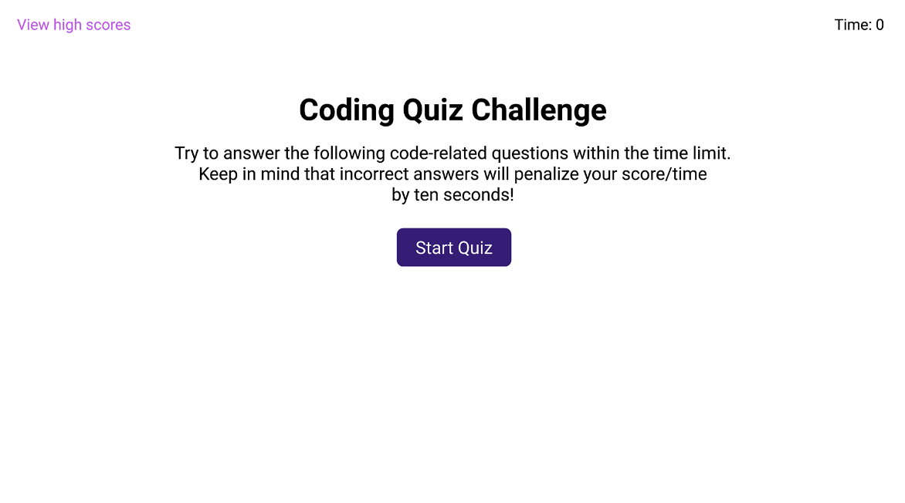

# quiz-game

# week-3-challenge

## User Story

 

AS A coding boot camp student
I WANT to take a timed quiz on JavaScript fundamentals that scores high scores
SO THAT I can guage my progress compared to my peers

# Acceptance Criteria

GIVEN I am taking a code quiz
 

<ul>
<li>WHEN I click the start button</li>
<li>THEN a timer starts and I am presented with a question</li>
<li>WHEN I answer a question</li>
<li>THEN I am presented with another question</li>
<li>WHEN I answer a question incorrectly</li>
<li>THEN time is subtracted from the clock</li>
<li>WHEN all questions are answered or the timer reaches 0</li>
<li>THEN the game is over</li>
<li>WHEN the game is over</li>
<li>THEN I can save my initials and score</li>
</ul>

[Deployed Site](https://levimendyk.github.io/quiz-game/)

Contribution guidelines for this project

